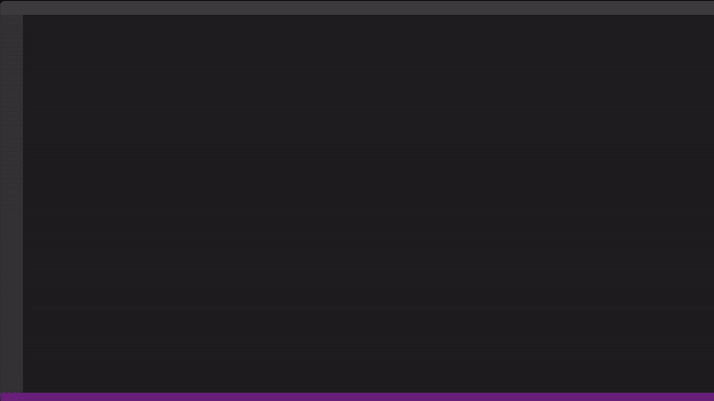
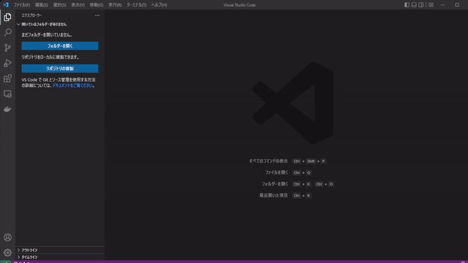
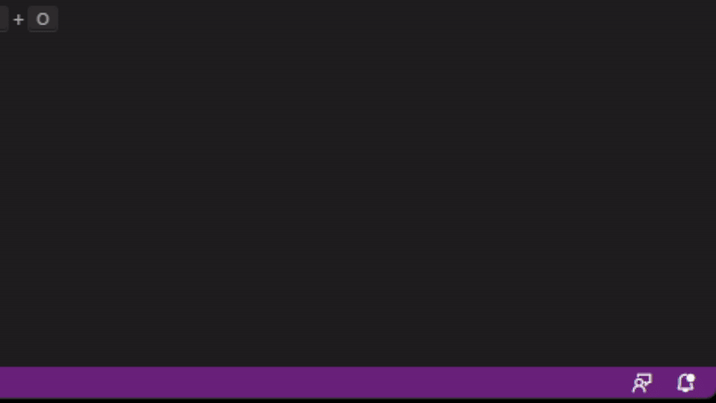

# screcommender README

この拡張機能は、あなたにショートカットキーのご提案をします。

提案されるときは、ショートカットキーが登録されているコマンドをショートカットキーを使用せずに実行したときです。

## 使用方法

ウィンドウ作成時にログレベルを`トレース`を選択してください。

## 機能

ショートカットキーが登録されているコマンドをショートカットキーを使用せずに実行した場合に、登録されているショートカットキーをポップアップで表示します。

## 注意

この拡張機能は、あなたのログファイルとキーバインドを登録しているファイルを使用します。
加えて、上記のファイルがデフォルトのディレクトリにない場合は正常に動作しません。
